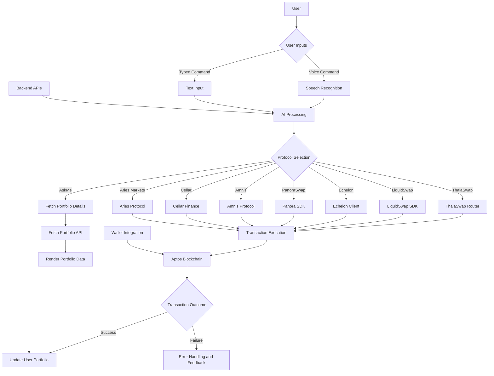

# Aptos Vocal AI trading

Bringing Aptos Defi on your fingertips, Now Trade Smartly on Aptos with just your Voice – In Any Language! and get the best routes for swap, lending-borrowing etc.

This project utilizes solvers to build and execute transactions on behalf of the users.

### Description
Experience seamless trading and portfolio management through voice commands in any language. Leveraging advanced AI and speech technologies, our platform translates your spoken commands into actionable trades and portfolio adjustments. Harness the power of the Speech API, OpenAI, and the Brian API and SDK to make trading effortless and multilingual.

### Problem Statement

**1. Wallet Setup Complexity:**  
Users often face difficulties in setting up and managing crypto wallets, a prerequisite for engaging in DeFi activities. This technical barrier discourages potential users from entering the space.

**2. Language Barriers:**  
The global nature of cryptocurrency is hindered by language barriers, limiting non-English speakers' ability to participate effectively in trading and portfolio management.

**3. Knowledge Barriers:**  
Many users lack the necessary understanding of DeFi protocols, making it challenging to navigate the complexities of decentralized finance. This knowledge gap prevents them from making informed decisions and taking advantage of the best trading opportunities available.

**4. Optimal Trade Routes:**  
Users struggle to identify the best routes for swaps, cross-chain swaps, and bridge operations across different chains. This lack of clarity can result in suboptimal trades and missed opportunities.

**5. Onboarding Challenges:**  
The onboarding process for new users into the DeFi ecosystem is often cumbersome, involving multiple steps and a steep learning curve. Simplifying this process is crucial to enhancing user adoption.

### Features
- **Multilingual Voice Commands:** Execute trades and manage your portfolio using voice commands in languages like Spanish, German, French, and more.
- **AI-Driven Translation:** Utilize advanced AI to accurately translate your voice commands, ensuring precise execution of your trading strategies.
- **Speech API Integration:** Benefit from state-of-the-art speech recognition technology for seamless interaction.
- **OpenAI Integration:** Leverage OpenAI for natural language processing and understanding.
- **Brian API & SDK:** Solve intents and execute interactions with high accuracy and efficiency.
- **Secure and Reliable:** Ensure your transactions are secure with robust backend technology.
- **User-Friendly Interface:** Enjoy an intuitive and responsive design tailored for a smooth user experience.
- **Wallet Connect Integration:** Seamlessly connect your preferred aptos Wallets to the Dapp

### Project Architecture

## Project Architecture

### How It Works
1. **Voice Input:** Speak your trading commands in your preferred language.
2. **Speech Recognition:** The Speech API captures and transcribes your voice input.
3. **AI Translation:** OpenAI translates the transcribed text into English or the platform's base language.
4. **Intent Analysis:** The Brian API and SDK analyze the translated commands to understand the user's intent.
5. **Execution:** The platform executes the trade or portfolio action based on the analyzed intent.
6. **Token Swapping:** We are Utilizing AppKit’s Swaps feature to execute seamless token exchanges directly within the app.
7. **Feedback:** Receive real-time feedback and confirmation of your actions, all via voice interaction.

This streamlined process ensures that language barriers are eliminated, making trading more accessible and convenient for users worldwide.
